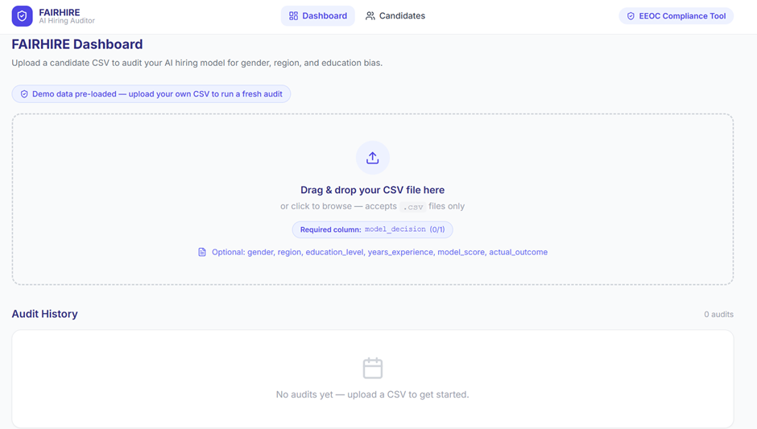
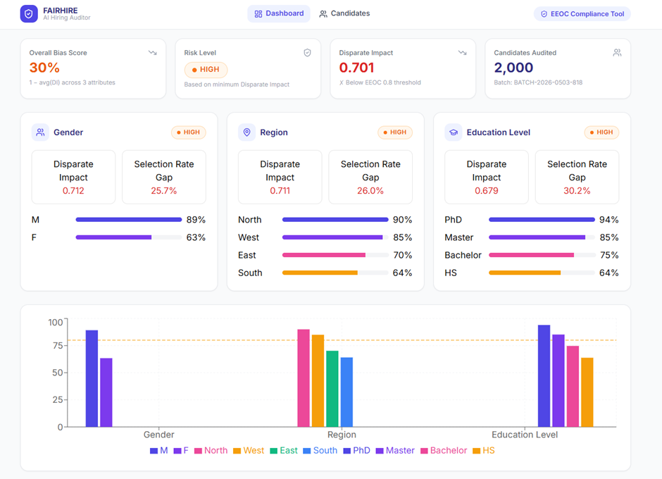
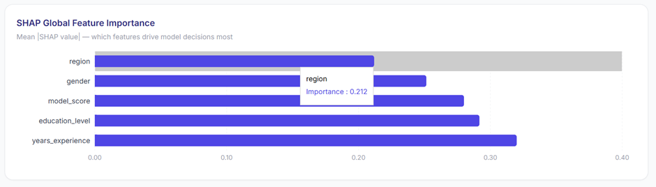
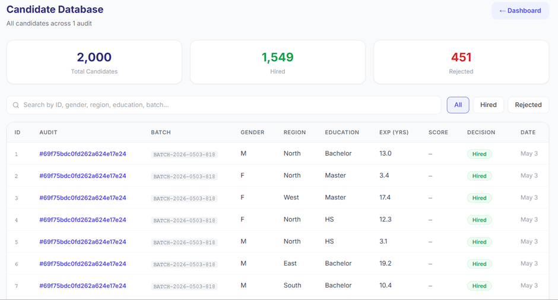
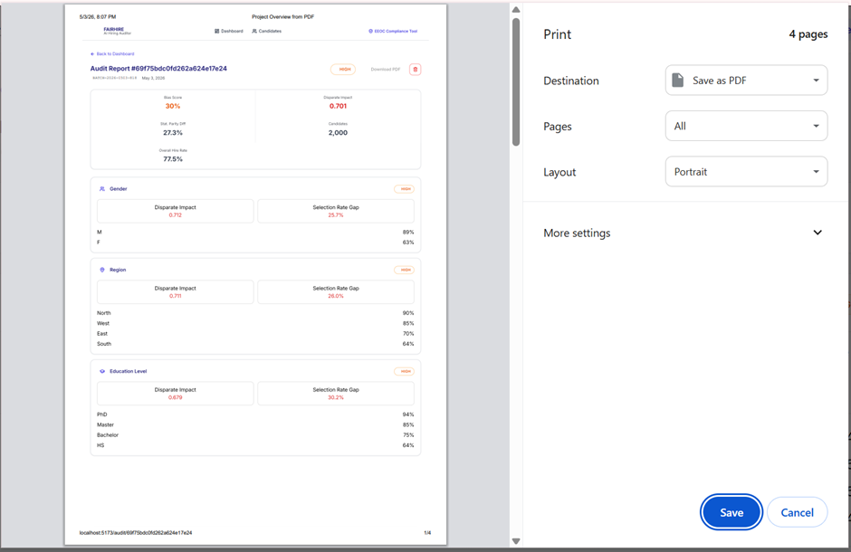

# FAIRHIRE – AI Hiring Bias Detection & Audit Platform

## Live Demo

* **Frontend:** https://fairhire-seven.vercel.app
* **Backend API:** https://fairhire-backend-xg3f.onrender.com

---

## Overview

FAIRHIRE is an AI-powered hiring audit platform developed to identify, analyze, and report recruitment bias using fairness metrics and explainable AI techniques.

The platform helps organizations evaluate hiring decisions for potential bias across attributes such as gender, region, and education level, promoting transparent and ethical recruitment practices.

---

## Problem Statement

Recruitment systems and AI-driven hiring tools may unintentionally introduce bias during candidate evaluation and selection.

Such bias can impact fairness and create unequal opportunities across demographic groups.

FAIRHIRE addresses this challenge by auditing recruitment datasets, measuring fairness indicators, and generating visual reports that support responsible and unbiased hiring decisions.

---

## Features

* AI hiring bias detection and auditing
* Fairness metrics dashboard
* EEOC compliance insights
* Gender, region, and education bias analysis
* Interactive data visualization and analytics
* Candidate audit tracking
* CSV-based dataset upload
* PDF audit report generation
* User-friendly interface
* Secure data handling

---

## Tech Stack

### Frontend

* React
* TypeScript
* Tailwind CSS
* Axios
* Vite

### Backend

* Node.js
* Express.js
* REST APIs

### Database

* MongoDB Atlas

### Tools & Deployment

* GitHub
* Postman
* Render
* Vercel

---

## Project Workflow

Data Upload
→ Data Processing
→ Bias Detection
→ Fairness Metrics Calculation
→ Dashboard Analytics
→ Report Generation

---

## Installation Guide

### Clone Repository

```bash
git clone https://github.com/Varshitha-567/FAIRHIRE.git
```

### Frontend Setup

```bash
cd frontend
npm install
npm run dev
```

### Backend Setup

```bash
cd backend
npm install
npm run dev
```

Create a `.env` file inside backend:

```env
MONGO_URI=your_mongodb_uri
JWT_SECRET=your_secret_key
```

---

## Screenshots

### Landing Page



### Bias Dashboard



### SHAP Output



### Candidate Audit



### PDF Report



---

## Future Enhancements

* Resume screening integration
* Advanced fairness-aware ML models
* Real-time bias monitoring
* Cloud scalability improvements
* Role-based access control
* Predictive hiring insights
